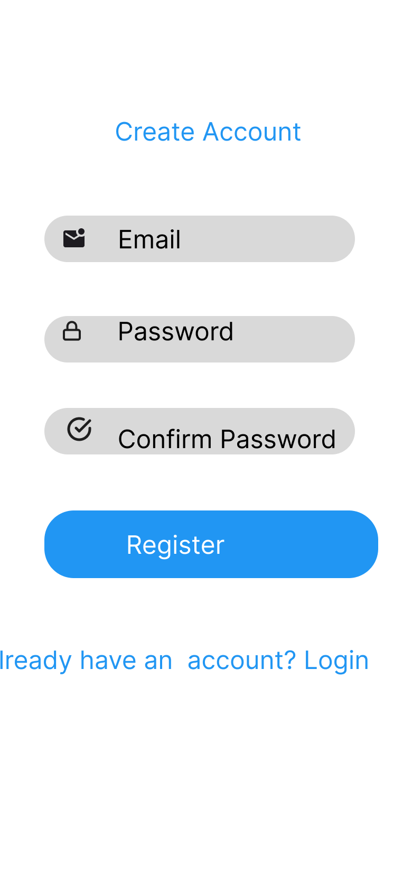
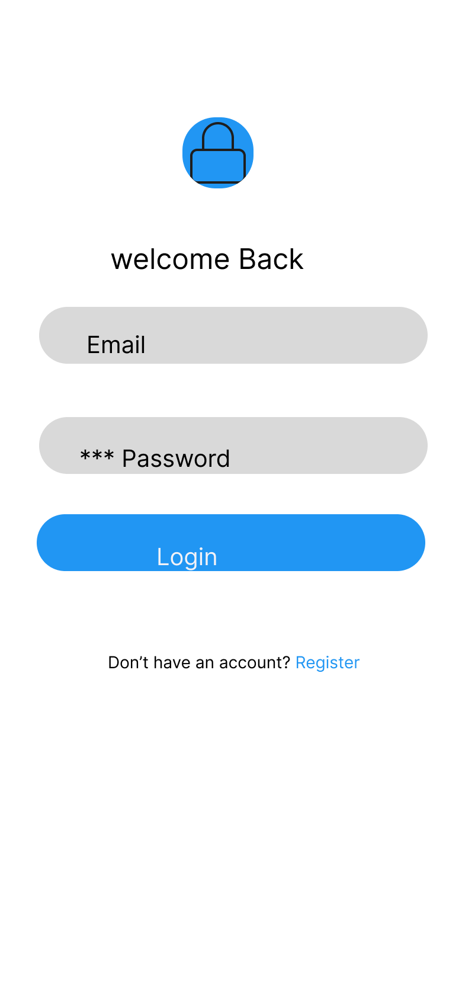
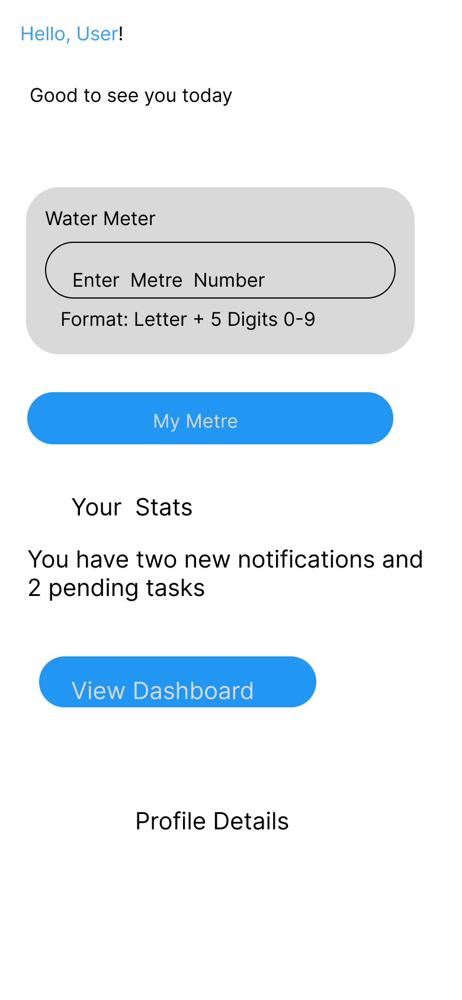
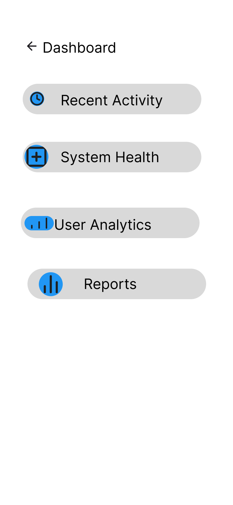
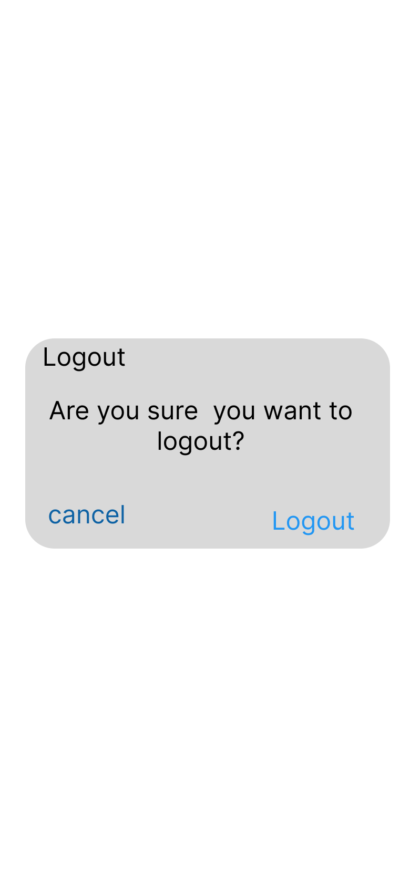

#Water meter tracking app with email/password authentication.
##User Flow
## 1. Registration Screen

*Details*
-Fields: Email,Password,Confirm Password
-Validation: Password must be 8+ characterrs
-Button: `Register` Creates account then redirects to login screen
## 2. Login Screen

*Details*
Fields: Email,Password
Error:"Invalid Credentials" if wrong
Button `login` If valid, redirects to home screen
## 3. Home Screen

*Details*
Input Format: Letter + 5 digits, e.g. `A12345`
Validation: Shows error if format is wrong
Button: `Submit` Saves reading then navigates to dashboard
## 4. Dashboard Screen

*Details*
Shows: Recent Activity,System Health,User Analytics
No input needed just display
Top right: User profile menu
## 5. Logout Screen

*Details*
Action: Clears session token
Confirmation: "Are you sure?" popup
Redirect: Back to login Screen
